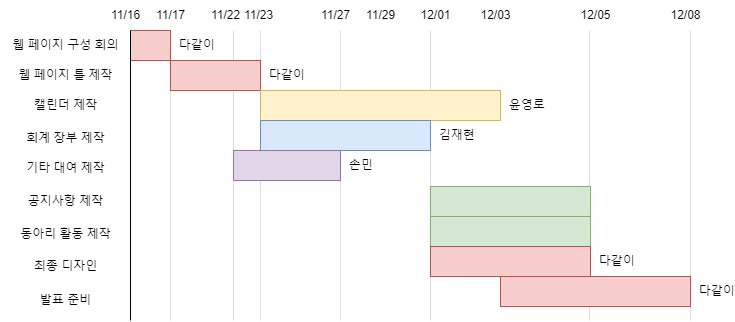
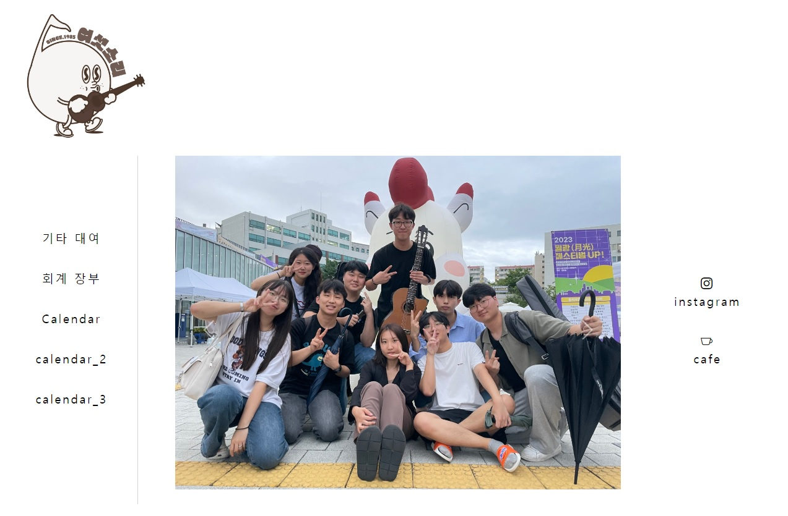
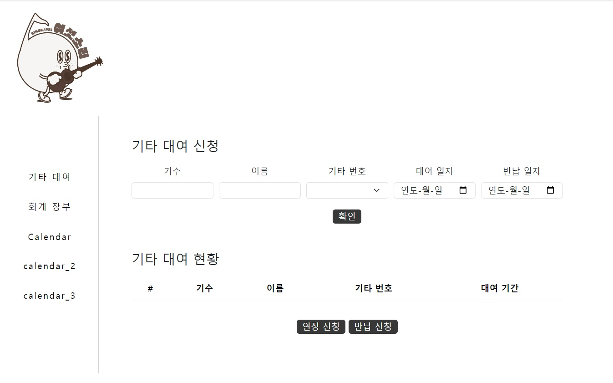
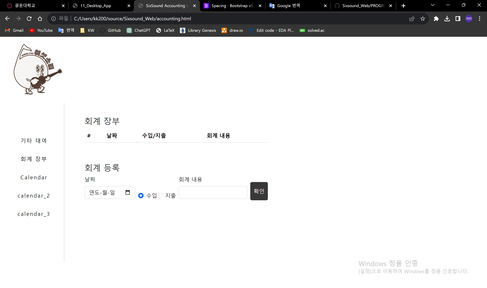
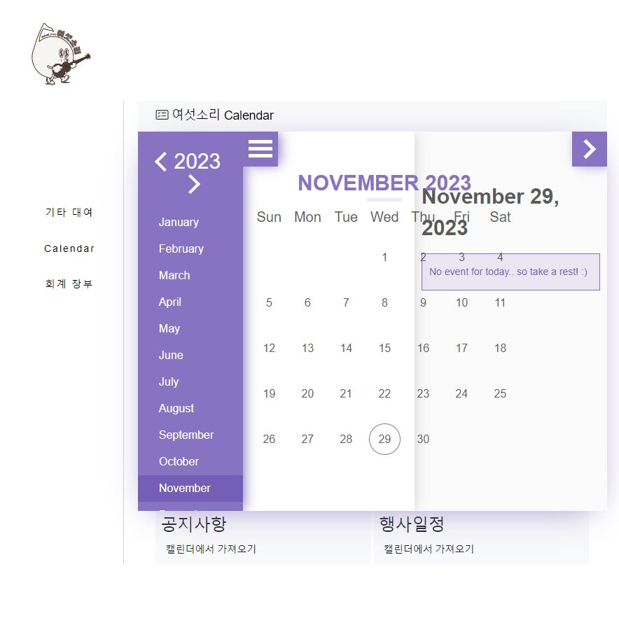

# Progress Report for Team #6

## Progress Summary

### 클래식 기타 동아리인 '여섯소리'의 웹페이지 제작

시작 화면, 캘린더, 기타 대여 및 반납, 회계 장부 크게 4가지 페이지로 구성할 계획입니다.

현재까지의 진행상황

1. <strong>웹페이지의 시작화면</strong>의 큰 틀을 구현하여 나머지 모든 페이지에 그 틀을 통일시켰습니다.
2. <strong>기타 대여 및 반납 페이지</strong>에서는 기타를 대여하고자 하는 학생의 정보와 원하는 기타 번호, 대여 기간을 입력 받아 기타를 대여할 수 있도록 했습니다.
   대여 및 반납 시 대여현황에 자동 추가 및 삭제되도록 하였습니다. 연장 버튼을 누르면 자동으로 1주일 연장이 되며, 반납버튼을 누르면 반납처리가 되도록 구현했습니다.
3. <strong>캘린더 페이지</strong>는 evoCalendar을 이용하여 큰 틀을 구성했고, 해당 날짜를 클릭할 시에 그 날짜에 해당하는 일정이 뜨도록 구현하는 중입니다. 
4. <strong>회계 페이지</strong>는 날짜, 수입/지출, 회계 내용을 입력하면 해당 회계 내용이 업로드 되도록 구현했습니다. 수입/지출의 경우 radio button을 활용하여 수입/지출 중 한가지만 선택할 수 있도록 구현했습니다.

### Project Schedule

프로젝트 진행 상황입니다. 추후에 추가할 기능(공지사항, 동아리 활동 페이지 제작 등)은 프로젝트 진행 상황에 맞게 역할 분담을 하여 진행할 계획입니다.

### Project Screenshot

웹페이지 시작 화면입니다.

기타 대여 및 반납 페이지입니다.

회계 장부 페이지입니다.

캘린더 페이지입니다.

## Individual Progress Status

### 윤영로 2019202046

### 김재현 2020202031

- 회계 장부 페이지 구현 : 날짜, 수입/지출, 회계 내용 입력 칸, 확인 버튼 구현

### 손 민 2022202012

- 기타 대여 페이지 구현 : 기타 대여 신청, 연장 신청, 반납 신청 ([Commit Link](https://github.com/zeroad00/Sixsound_Web/commit/1b8ea0e4ff12980b47e0b2a8a8222fcd20614b6e#diff-c6ba6392846af6e6c79c00cf3d91a49c106417d86308e873b4ff37a2aa4ae45f))
- 기타 대여 페이지 디자인 ([Commit Link](https://github.com/zeroad00/Sixsound_Web/commit/90c7a2ac09aecf49410a96ec079df2cd17c54a7b))
- 시작 화면 디자인 ([Commit Link](https://github.com/zeroad00/Sixsound_Web/commit/f44f4c03d2d19d6b0b100d99edd9acf56f117b47))
