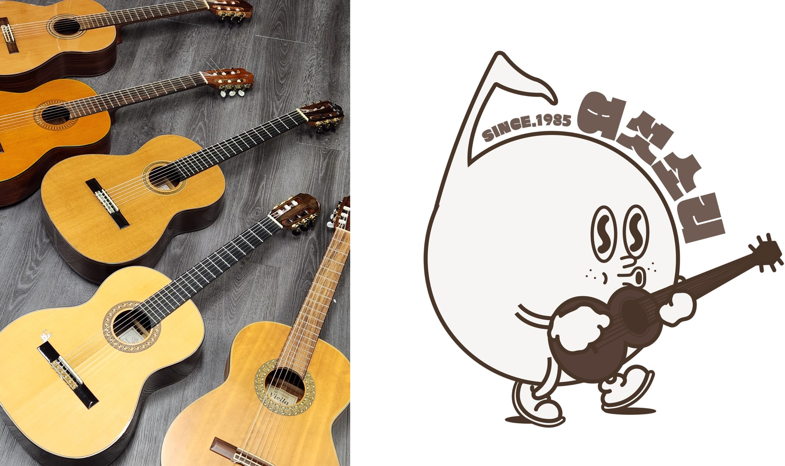

# Sixsound_Web

<page link>  
https://zeroad00.github.io/Sixsound_Web/1.html

OpenSource Software project 6조  
2019202046 윤영로
2020202031 김재현
2022020212 손 민  

## Project Specification

### Title

동아리 웹 페이지 만들기  

### Abstract

기타 동아리 웹 페이지를 만든다. 웹페이지에 들어갈 내용은 다음과 같다.

1. 동아리 캘린더 (연습 및 행사 일정 등)
2. 동아리 기타 대여 현황
3. 회계 장부
4. 연주회 영상 자료
5. 연도별 인수인계 자료

### Images

### Project schedule

- 11월 3일 ~ 11월 13일 : HTML 틀 만들기
- 11월 14일 ~ 11월 23일 : CSS 디자인하기
- 11월 24일 ~ 11월 30일 : JavasSript 작성
- 12월 1일 ~ 12월 7일 : 프로젝트 발표 준비

### Team roles

<table>
<tr>
    <th>이름</th>
    <th>역할</th>
</tr>
<tr>
    <td>윤영로</td>
    <td>동아리 캘린더 파트 제작</td>
</tr>
<tr>
    <td>김재현</td>
    <td>회계 장부 파트 제작</td>
</tr>
<tr>
    <td>손 민</td>
    <td>기타 대여 현황 파트 제작</td>
</tr>
</table>

### Technology

HTML, CSS, JavaScript
